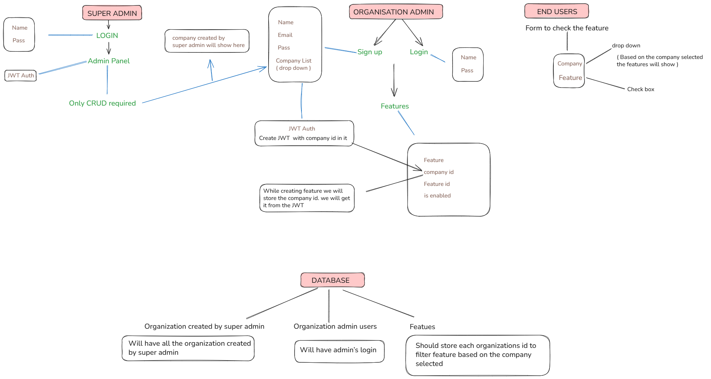

# Feature Flag Management System
A full-stack SaaS platform that allows organizations to manage feature flags across multiple tenants with secure role-based access.

## What it does
It is a feature falg management system. Example: Imagine Company X uses a SaaS tool. The SaaS company (Super Admin) creates an account for Company X. Company X's IT manager (Organisation Admin) logs in and turns features on/off for their team. For that specific team's employees (End Users) get those features based on what the IT manager enabled.

## Tech Stack
React • Vite  • Node.js • Express • MongoDB • JWT • Mongoose

## Setup

Clone the repo
- Backend
1. cd back-end && npm install
2. Create .env file with:
   - MONGO_URI=
   - PORT=5000
   - SUPER_ADMIN_USER_NAME=superAdmin
   - SUPER_ADMIN_USER_PASS=superAdmin
   - SECRET_KEY=
3. npm run dev

- Frontend (Three front end because 3 users)
1. cd super-admin-front-end && npm install , cd org-admin-front-end && npm install, cd end-user-front-end && npm install
2. npm run dev

## Flow


## Pattern — MVC (Model View Controller)

### Why MVC?
- Express is naturally MVC-friendly
- Clean separation between data, logic, and routes
- Easy to understand and explain
- Right-sized for this project scope

### Folder Structure

```
feature-flag-management-system/
├── back-end/                    # Express API server
├── super-admin-front-end/       # Super Admin UI
├── org-admin-front-end/         # Organization Admin UI
├── end-user-front-end/          # End User UI
└── wiki/                        # Documentation
```
back-end/
├── config/         # Database connection
├── controller/     # Business logic
├── middleware/     # JWT auth verification
├── model/          # MongoDB schemas
├── routes/         # API endpoints
└── server.js       # Entry point

## Roles & Responsibilities

### 1. Super Admin
- **Access**: Full system access via `/admin-panel`
- **Responsibilities**:
  - Create new organizations
  - Edit organization details
  - Delete organizations
  - View all organizations
- **Authentication**: Credentials stored in environment variables (`SUPER_ADMIN_USER_NAME`, `SUPER_ADMIN_USER_PASS`)
- **Frontend**: `super-admin-front-end`

### 2. Organization Admin
- **Access**: Organization-specific operations
- **Responsibilities**:
  - Manage feature flags within their organization
  - View organization details
  - Manage organization users
  - Enable or disable the features
- **Frontend**: `org-admin-front-end` 


### 3. End User
- **Access**: Read-only access to feature flags
- **Responsibilities**:
  - Check if features are enabled for their organization
- **Frontend**: `end-user-front-end`

